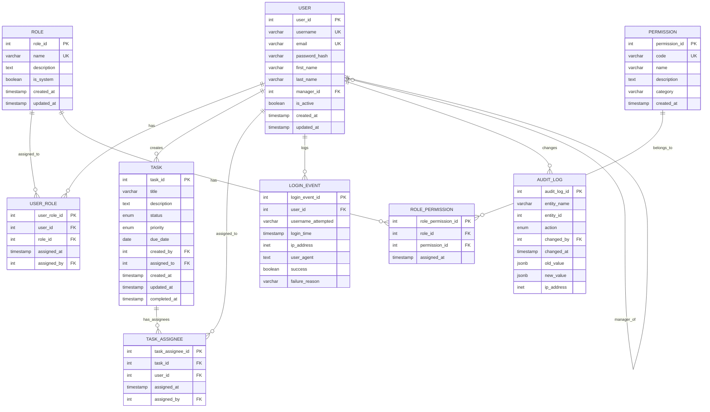

# ERA Dijagram - Ažurirani model s višestrukom dodjelom zadataka

## Mermaid kod za generiranje dijagrama

## Opis tablica

### Glavne tablice
| Tablica | Opis |
|---------|------|
| **users** | Korisnici sustava (zaposlenici) |
| **roles** | Uloge u sustavu (ADMIN, MANAGER, EMPLOYEE) |
| **permissions** | Pojedinačna prava pristupa |
| **tasks** | Zadaci u sustavu |

### Povezne tablice (M:N veze)
| Tablica | Veza | Opis |
|---------|------|------|
| **user_roles** | User ↔ Role | Dodjela uloga korisnicima |
| **role_permissions** | Role ↔ Permission | Dodjela prava ulogama |
| **task_assignees** | Task ↔ User | **NOVO** - Višestruka dodjela zadataka |

### Audit tablice
| Tablica | Opis |
|---------|------|
| **login_events** | Evidencija prijava u sustav |
| **audit_logs** | Evidencija promjena nad podacima |

## Kardinalnosti

- **User ↔ Role**: M:N (preko user_roles)
- **Role ↔ Permission**: M:N (preko role_permissions)  
- **Task ↔ User**: M:N (preko task_assignees) - **NOVO**
- **User → User**: 1:N (manager_id self-reference)
- **User → Task**: 1:N (created_by)
- **User → LoginEvent**: 1:N
- **User → AuditLog**: 1:N

## Promjene u odnosu na prethodnu verziju

1. **Nova tablica `task_assignees`** - omogućuje dodjelu istog zadatka više korisnika
2. **Ažuriran view `v_tasks_details`** - uključuje `assignee_ids` i `assignee_names` array-e
3. **Ažurirana funkcija `get_user_tasks`** - vraća zadatke iz nove tablice
4. **Backward compatibility** - `tasks.assigned_to` kolona ostaje za kompatibilnost
