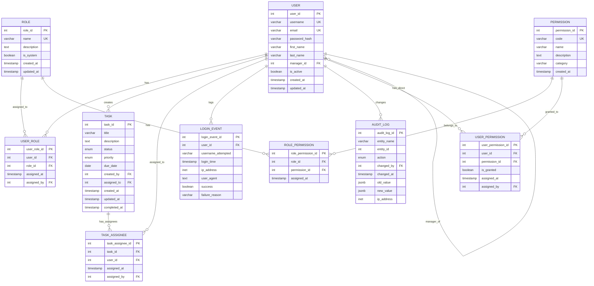

# ERA Dijagram - Konačni model baze podataka

## Mermaid kod za generiranje dijagrama



## Opis tablica

### Glavne tablice
| Tablica | Opis |
|---------|------|
| **users** | Korisnici sustava (zaposlenici) |
| **roles** | Uloge u sustavu (ADMIN, MANAGER, EMPLOYEE) |
| **permissions** | Pojedinačna prava pristupa |
| **tasks** | Zadaci u sustavu |

### Povezne tablice (M:N veze)
| Tablica | Veza | Opis |
|---------|------|------|
| **user_roles** | User ↔ Role | Dodjela uloga korisnicima |
| **role_permissions** | Role ↔ Permission | Dodjela prava ulogama |
| **user_permissions** | User ↔ Permission | **NOVO** - Direktna dodjela prava korisnicima |
| **task_assignees** | Task ↔ User | Višestruka dodjela zadataka |

### Audit tablice
| Tablica | Opis |
|---------|------|
| **login_events** | Evidencija prijava u sustav |
| **audit_logs** | Evidencija promjena nad podacima |

## ENUM tipovi

### task_status
| Vrijednost | Opis |
|------------|------|
| `NEW` | Novi zadatak |
| `IN_PROGRESS` | U tijeku |
| `ON_HOLD` | Na čekanju |
| `PENDING_APPROVAL` | **NOVO** - Čeka odobrenje managera |
| `COMPLETED` | Završeno |
| `CANCELLED` | Otkazano |

### task_priority
| Vrijednost | Opis |
|------------|------|
| `LOW` | Nizak prioritet |
| `MEDIUM` | Srednji prioritet |
| `HIGH` | Visok prioritet |
| `URGENT` | Hitan |

### audit_action
| Vrijednost | Opis |
|------------|------|
| `INSERT` | Kreiranje zapisa |
| `UPDATE` | Ažuriranje zapisa |
| `DELETE` | Brisanje zapisa |

## Kardinalnosti

- **User ↔ Role**: M:N (preko user_roles)
- **Role ↔ Permission**: M:N (preko role_permissions)  
- **User ↔ Permission**: M:N (preko user_permissions) - **NOVO**
- **Task ↔ User**: M:N (preko task_assignees)
- **User → User**: 1:N (manager_id self-reference)
- **User → Task**: 1:N (created_by)
- **User → LoginEvent**: 1:N
- **User → AuditLog**: 1:N

## Workflow odobravanja zadataka

```
┌─────────────┐     ┌──────────────┐     ┌───────────────────┐     ┌────────────┐
│    NEW      │ ──► │ IN_PROGRESS  │ ──► │ PENDING_APPROVAL  │ ──► │ COMPLETED  │
└─────────────┘     └──────────────┘     └───────────────────┘     └────────────┘
                          │                       │
                          ▼                       │ (Manager vraća)
                    ┌──────────┐                  │
                    │ ON_HOLD  │ ◄────────────────┘
                    └──────────┘
```

- **Employee** može: NEW → IN_PROGRESS → ON_HOLD → PENDING_APPROVAL
- **Manager/Admin** može: PENDING_APPROVAL → COMPLETED (odobravanje)
- **Manager/Admin** može: PENDING_APPROVAL → IN_PROGRESS (vraćanje na doradu)

## Promjene u odnosu na početnu verziju

1. **Nova tablica `user_permissions`** - direktna dodjela permisija korisnicima
2. **Nova tablica `task_assignees`** - višestruka dodjela zadataka
3. **Novi status `PENDING_APPROVAL`** - workflow odobravanja zadataka
4. **Ažurirani viewovi** - uključuju nove tablice i relacije
4. **Backward compatibility** - `tasks.assigned_to` kolona ostaje za kompatibilnost
